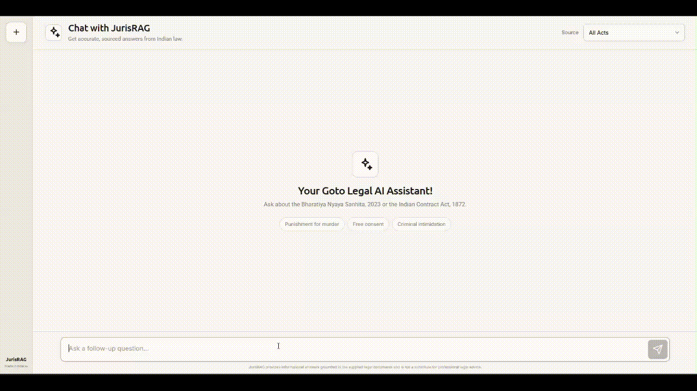
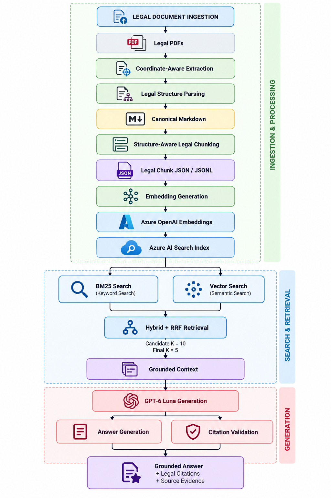

# JurisRAG — Citation-Enforced Legal RAG System

**JurisRAG is a production-grade deployable RAG system. It is a citation-enforced legal Retrieval-Augmented Generation (RAG) system designed to produce grounded answers from Indian legal documents.**

Every generated answer is **grounded in retrieved legal evidence and required to provide citations** to the underlying statutory sections. The system also evaluates its generated answers across important RAG quality dimensions including **relevance, correctness, groundedness, completeness, citation correctness, citation completeness, context utilization, abstention quality, and hallucination**.

JurisRAG is built to explore how a legal RAG system can combine **structure-aware document ingestion, hybrid retrieval, citation enforcement, grounded generation, evaluation, and containerized deployment** into a single end-to-end system.

---

## Demo

<!-- TODO: Add a GIF showing the JurisRAG application answering a legal question -->



---

## Key Features

- **Grounded legal answers**
  - Answers are generated from retrieved evidence rather than unrestricted model knowledge.
  - The generation prompt explicitly restricts the model to the retrieved legal context.

- **Citation-enforced generation**
  - Substantive claims are expected to cite the corresponding legal provision.
  - Citations use structured section references such as `[BNS §103]` and `[ICA §73]`.

- **Hybrid legal retrieval**
  - Combines traditional lexical/BM25 retrieval with vector similarity search.
  - Uses Reciprocal Rank Fusion (RRF) to combine retrieval signals.

- **Azure AI Search vector retrieval**
  - Dense embeddings are stored alongside legal text and metadata.
  - HNSW is used for approximate nearest-neighbor vector search.

- **Azure OpenAI embeddings**
  - Uses `text-embedding-3-large`.
  - Embedding dimensionality: 1536.

- **GPT-based grounded generation**
  - Uses the deployed `gpt-6-luna` model through Azure OpenAI.

- **Structure-aware legal chunking**
  - Preserves act, chapter, section, subsection, marginal note, and content-type information.

- **Insufficient-evidence handling**
  - The system can explicitly indicate when the retrieved evidence is insufficient instead of fabricating an answer.

- **Evaluation-driven development**
  - Retrieval and answer-generation stages were evaluated independently.
  - A 50-question golden dataset was used for answer-level evaluation.

- **Dockerized deployment**
  - Backend and frontend are packaged as independent Docker images.
  - Images are automatically published to GitHub Container Registry (GHCR).

- **GitHub Actions CI/CD**
  - Every push to `main` can trigger container builds and publication.

---

# Architecture

At a high level, JurisRAG follows this pipeline:


## Evaluation Results

### Retrieval Evaluation

Multiple retrieval strategies were evaluated to determine the most effective configuration for **JurisRAG**:

* **BM25**
* **Vector Search**
* **Hybrid Search + Reciprocal Rank Fusion (RRF)**

The evaluation compared retrieval performance across different candidate and final result sizes.

### Production Retrieval Configuration

Based on the evaluation, **Hybrid Search + RRF** was selected as the production retrieval strategy.

```text
Retrieval Strategy : Hybrid Search + RRF
Candidate K        : 10
Final K            : 5
MMR                : Disabled
```

This configuration combines **lexical matching (BM25)** with **semantic vector similarity**, while **RRF** merges the rankings produced by both retrieval methods.

---

### Hybrid Retrieval — Section-Level Results

The selected hybrid retrieval configuration achieved the following results on the section-level evaluation set:

| Metric                                 |     Result |
| :------------------------------------- | ---------: |
| **Recall@5**                           |  **95.5%** |
| **Hit Rate@5**                         |   **100%** |
| **MRR**                                | **95.07%** |
| **nDCG@5**                             | **94.13%** |
| **Average Pairwise Cosine Similarity** | **0.7255** |
| **Redundancy Rate**                    |     **0%** |
| **Unique Section Ratio**               |   **100%** |

### Retrieval Configuration Analysis

The retrieval evaluation also examined multiple combinations of candidate and final result sizes:

* **Candidate K:** `10`, `20`, `50`
* **Final K:** `1`, `3`, `5`, `10`

The production configuration uses:

```text
Candidate K = 10
Final K     = 5
```

This configuration was selected to provide a balance between **retrieval coverage** and **context efficiency**, ensuring that relevant legal sections are retrieved while limiting the amount of retrieved context passed to the generation stage.

Overall, the evaluation supports the use of **Hybrid Search + RRF with `Candidate K = 10` and `Final K = 5`** as the production retrieval configuration for JurisRAG.

## Answer-Level Evaluation

The complete **JurisRAG** system was evaluated end-to-end using **50 legal questions** through the full **retrieval + generation pipeline**.

The evaluation measures not only the quality of the generated answers, but also whether answers are properly grounded in the retrieved legal context and supported by correct citations.

### Evaluation Metrics

The following dimensions were evaluated:

### Answer-Level Results

| Metric                    |      Score |
| :------------------------ | ---------: |
| **Answer Relevance**      | **97.92%** |
| **Answer Correctness**    | **95.83%** |
| **Groundedness**          | **96.88%** |
| **Answer Completeness**   | **95.83%** |
| **Citation Correctness**  | **97.92%** |
| **Citation Completeness** |   **100%** |
| **Context Utilization**   |   **100%** |
| **Abstention Quality**    |   **100%** |
| **Hallucination**         |  **3.12%** |

> **Note:** Hallucination is an error-oriented metric, therefore **lower values are better**.

---

### Deterministic Evaluation Checks

In addition to model-based evaluation metrics, JurisRAG performs deterministic checks to verify retrieval coverage, citation support, and critical failure conditions.

### Deterministic Check Summary

| Check                               |    Result |
| :---------------------------------- | --------: |
| **Questions Evaluated**             |    **50** |
| **Direct Gold Coverage**            |  **100%** |
| **Gold Section Coverage**           | **95.5%** |
| **Direct Gold Not Fully Retrieved** |     **0** |
| **Unsupported Citations**           |     **0** |
| **Material Hallucination**          |     **0** |
| **Correctness Score of Zero**       |     **0** |
| **Groundedness Score of Zero**      |     **0** |

### Evaluation Scope

This provides evaluation coverage across **retrieval quality, answer quality, grounding, citation reliability, context utilization, abstention behavior, and hallucination**, rather than relying on a single aggregate score.

# Docker Deployment

JurisRAG is distributed as two Docker images:

```text
ghcr.io/parth-udawant/jurisrag-backend:latest
ghcr.io/parth-udawant/jurisrag-frontend:latest
```

The images contain the application runtime. **Azure credentials must be supplied through environment variables at runtime.**

## Prerequisites

Install:

* [Docker Desktop](https://www.docker.com/products/docker-desktop/)
* Git

You also need access to:

* Azure OpenAI
* Azure AI Search

---

## Quick Start

### 1. Clone the Repository

```bash
git clone https://github.com/Parth-Udawant/JurisRAG---Citation-Enforced-Legal-RAG-System.git
cd JurisRAG---Citation-Enforced-Legal-RAG-System
```

### 2. Configure Environment Variables

Create your `.env` file:

```bash
cp .env.example .env
```

On Windows PowerShell:

```powershell
Copy-Item .env.example .env
```

Configure the required Azure credentials and deployment settings:

```env
AZURE_OPENAI_ENDPOINT=https://<your-resource>.openai.azure.com/
AZURE_OPENAI_API_KEY=<your-key>
AZURE_OPENAI_API_VERSION=2024-10-21

AZURE_OPENAI_EMBEDDING_DEPLOYMENT=legal-embedding
AZURE_OPENAI_EMBEDDING_MODEL=text-embedding-3-large
AZURE_OPENAI_EMBEDDING_DIMENSIONS=1536

AZURE_OPENAI_GPT_DEPLOYMENT=gpt-6-luna

AZURE_SEARCH_ENDPOINT=https://<your-search-service>.search.windows.net
AZURE_SEARCH_ADMIN_KEY=<your-key>
AZURE_SEARCH_INDEX_NAME=legal-rag-search-vectors

GPT_MAX_TOKENS=1800
```

> **Do not commit `.env` to the repository.** Only `.env.example` should be committed.

### 3. Pull and Start JurisRAG

```bash
docker compose pull
docker compose up -d
```

Verify the containers:

```bash
docker compose ps
```

### 4. Open the Application

Once the containers are running, open:

**Frontend:** http://localhost:3000

**Backend Health Check:** http://localhost:8000/health

Expected health response:

```json
{
  "status": "ok",
  "service": "legal-rag-api"
}
```

### 5. Stop the Application

```bash
docker compose down
```

To start it again:

```bash
docker compose up -d
```


## Author

**Parth Udawant**
*M.Tech — Computer Science and Engineering*
*National Institute of Technology Goa*

### Areas of Interest

* Generative AI
* Retrieval-Augmented Generation (RAG)
* Large Language Models (LLMs)
* Multimodal AI
* Computer Vision
* Natural Language Processing (NLP)
* Deep Learning
